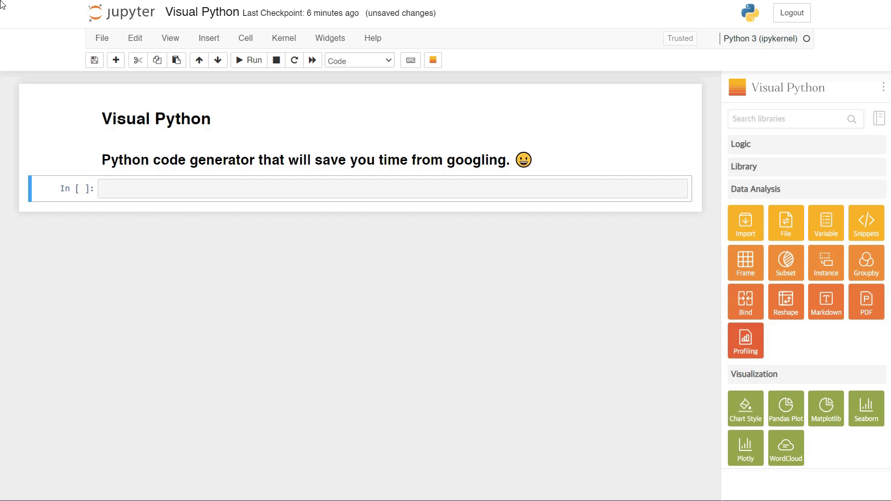

# 5. Subset

<figure><figcaption></figcaption></figure>

1. Click the _**Subset**_ in the _**Data Analysis**_ category.

***

<figure><figcaption></figcaption></figure>

2. _**Data Frame**_: Select the data frame you want to use for your work.
3. _**Make a copy**_: Check if you don't want the operation to affect the original data frame.
4. _**Method**_: Select a method to specify which rows or columns the action will be applied to.
5. _**Allocate to**_: Specify the name of the variable where the results of your work will be stored.
6. _**Row Subset**_: Select the rows you want to work with.
   1. _**Slicing**_: Extract rows by specifying a range.
   2. _**Condition**_: Specify the range of rows based on a condition.
   3. _**Indexing**_: Manually select the desired rows.
7. _**Column Subset**_: Select the columns you want to work with.
   1. _**Indexing**_: Manually extract the desired columns.
   2. _**Slicing**_: Specify the range of columns to extract.
8. _**Code View**_: Preview the code that will be output.
9. _**Data View**_: Preview the output that will be printed.
10. _**Run**_: Print and run the code.

